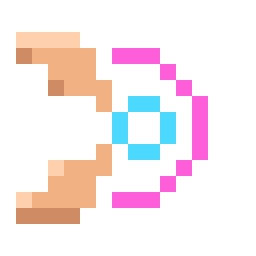

<p align="center">
  
</p>

<h1 align="center">Fingertune</h1>

<p align="center">
  <a href="https://github.com/qthullie/fingertune/actions/workflows/ci.yml"></a>
  <a href="LICENSE"></a>
  
  
  
</p>

> A rhythm game has one job: reward you for being *exactly* on time. Move that
> judgement from a key switch to a **pinch of your fingers**, seen through a
> webcam, and the whole chain — camera latency, jitter, thresholding — becomes
> the instrument. Fingertune is that chain, tuned.

An **Osu!-style rhythm game played with your fingers**. Circles appear with a
shrinking approach ring; pinch thumb and index together at the exact moment the
ring closes on the target. Hand tracking runs on **MediaPipe Hand Landmarker**,
entirely in the browser.

**No video ever leaves your machine.** No server, no upload, no account —
the page is static and the webcam frames stay in the tab.

<p align="center">
  <em>React 18 · TypeScript (strict) · Vite · Tone.js · MediaPipe Tasks Vision</em>
</p>

## Table of contents

- [Why](#why)
- [Two-minute tour](#two-minute-tour)
- [How to play](#how-to-play)
- [Features](#features)
- [Architecture](#architecture)
- [Tuning the feel](#tuning-the-feel)
- [Writing your own beatmap](#writing-your-own-beatmap)
- [Fully offline mode](#fully-offline-mode)
- [Deployment](#deployment)
- [Development](#development)
- [Troubleshooting](#troubleshooting)
- [Limitations](#limitations)
- [License](#license)

## Why

Gesture demos usually stop at "look, it tracks my hand". A rhythm game is a
harsher judge: it asks *when* the gesture happened, to within 60 ms, and it
punishes every false positive. That forces the parts most demos skip:

- **hysteresis** on the pinch, so a shaky threshold can't flicker a hit into
  existence;
- a **One-Euro filter** on the landmarks, so the cursor is stable when your hand
  is still and still responsive when it moves;
- a **hand-size-normalised** pinch ratio, so the same threshold works whether
  you sit close to the webcam or far from it;
- **timing decoupled from rendering** — the clock is the audio context, not
  `requestAnimationFrame`, so a dropped frame never shifts the beat.

Everything is in one small, readable, dependency-light codebase you can fork and
retune.

## Two-minute tour

```bash
git clone https://github.com/qthullie/fingertune.git
cd fingertune
npm install
npm run dev
```

Open the printed URL (`http://localhost:5173`) and click
**Autoriser la webcam / Jouer**. The hand-tracking model (~7 MB) downloads on
first launch, then stays cached.

> The webcam requires a secure context: `localhost` or `https://`. An
> `index.html` opened over `file://` is blocked by most browsers.

Prefer zero build? [`standalone/fingertune.html`](standalone/fingertune.html) is
the whole game in **one HTML file** (everything from CDNs). Handy to try quickly
or hand to a friend; the React app is the version that gets developed.

## How to play

| Action | Gesture |
| --- | --- |
| Hit a target | go from **fingers apart** to **fingers pinched** on it |
| Aim | the cursor is the **midpoint** between thumb and index |

- Sit ~60–100 cm from the webcam, palm facing the camera.
- **Perfect** < 60 ms, **Good** < 120 ms, anything later is a **Miss**.
- The combo grows on every non-Miss hit and resets to zero on a Miss.
- Score is weighted by accuracy and combo (+2 % per combo, capped at 50).

Shortcuts: <kbd>R</kbd> replay · <kbd>M</kbd> metronome · <kbd>D</kbd> debug
overlay (live pinch ratio, FPS, thresholds).

## Features

- **Pinch detection with hysteresis**: separate on/off thresholds plus a
  cooldown — no flicker, no double-triggers
- **One-Euro filtering** on thumb and index landmarks: smooth at rest, low-lag
  when moving
- **Distance-invariant threshold**: the pinch ratio is normalised by hand size
  (wrist → middle-finger base), so it holds as you lean in or back
- **Audio-clock timing**: judgement uses `Tone.now()`; rendering is a separate
  `requestAnimationFrame` loop
- **Osu!-style approach rings** that reach the target radius exactly on the beat
- **Perfect / Good / Miss** windows, combo, weighted accuracy, per-hit timing
  error in milliseconds (`+34 ms (tard)`)
- **Hit feedback**: particle burst, grade-coloured flash, Tone.js synth whose
  pitch climbs with the combo — Miss stays deliberately silent
- **Editable beatmaps**: plain `{ x, y, t }` arrays, plus helpers for paths and
  rings
- **Two-hand ready**: one `MAX_HANDS` constant; the tracker, input and renderer
  already loop over N hands
- **Live tuning** from the browser console — no reload
- **Clear failure modes**: denied camera, missing camera, camera busy, model
  download failure each get their own message

## Architecture

```
webcam frame
      │  HandTracker (MediaPipe Hand Landmarker, VIDEO mode)
      ▼
 21 landmarks ──► One-Euro filter (lib/oneEuro.ts)
      │            smooth thumb tip (4) + index tip (8)
      ▼
 pinch ratio = |thumb−index| / |wrist−middleMCP|
      │  hysteresis + cooldown  ──► "justPinched" (rising edge)
      ▼
 GameEngine.tryHit(midpoint, view)          ┌────────────────────────────┐
      │  |now − t| → PERFECT / GOOD / MISS  │ clock: Tone.now()          │
      │  score, combo, accuracy             │ (audio, not rAF)           │
      ▼                                     └────────────┬───────────────┘
 GameSnapshot ──► React HUD (useSyncExternalStore, ~20 Hz)│
      │                                                  │
      └──────────► renderer.ts on <canvas> ◄─────────────┘
                   mirrored video · targets + approach rings · particles · hands
```

```
src/
  config/settings.ts       every knob, mutable at runtime
  beatmaps/                catalogue of charts (demo.ts ≈ 80 s)
  lib/
    oneEuro.ts             One-Euro filter (landmark smoothing)
    handTracking.ts        MediaPipe + pinch state machine (HandState / HandTracker)
    audio.ts               Tone.js: hit sounds, metronome, reference clock
    errors.ts              technical errors → human messages
  game/
    engine.ts              targets, timing windows, score/combo, React store
    effects.ts             particles, rings, flash
    types.ts               shared types
  render/
    view.ts                video → canvas "cover" transform
    renderer.ts            canvas drawing (mirrored video, targets, effects, hands)
  components/              GameCanvas (loop), Hud, StartScreen, ErrorScreen, EndScreen
  App.tsx                  orchestration
```

Two decisions shape the rest:

1. **Timing does not depend on rendering.** The game clock is the audio context
   (`Tone.now()`); `requestAnimationFrame` only draws. A dropped frame costs you
   pixels, never milliseconds.
2. **The engine is mutable, React reads a snapshot.** `GameEngine` runs at 60 fps
   without allocating and publishes an immutable `GameSnapshot` through
   `useSyncExternalStore`, re-published only when something changes (time
   quantised to 50 ms). The HUD therefore does not re-render 60 times a second.

Targets and landmarks live in the *same* normalised 0..1 space, anchored to the
displayed video rectangle — which is why a target drawn at `(x, y)` is reachable
by your hand at `(x, y)` on any window aspect ratio.

## Tuning the feel

Everything lives in [`src/config/settings.ts`](src/config/settings.ts):

| Setting | Default | Effect |
| --- | --- | --- |
| `PINCH_ON_RATIO` | `0.42` | pinch activation threshold — lower it if hits fire too early |
| `PINCH_OFF_RATIO` | `0.62` | release threshold — the hysteresis gap that kills flicker |
| `PINCH_COOLDOWN_MS` | `140` | minimum delay between two triggers |
| `TARGET_RADIUS` | `0.075` | target size (fraction of the image's smaller side) |
| `HIT_RADIUS_SCALE` | `1.35` | spatial tolerance of a hit |
| `APPROACH_TIME` | `1.1 s` | approach-ring duration — the real difficulty dial |
| `WINDOW_PERFECT` / `WINDOW_GOOD` | `60` / `120 ms` | timing windows |
| `OEF_MIN_CUTOFF` / `OEF_BETA` | `1.7` / `0.02` | One-Euro: lower = smoother, higher beta = snappier |
| `MAX_HANDS` | `1` | set to `2` to track both hands |

You can also retune **live** from the browser console, mid-run:

```js
fingertune.settings.PINCH_ON_RATIO = 0.35;
fingertune.settings.DEBUG = true;
```

## Writing your own beatmap

A note is `{ x, y, t }` — `x`/`y` normalised `0..1` inside the **already
mirrored** webcam image (`x = 0` is on your left as you look at the screen), `t`
in seconds from the start of the run.

```ts
// src/beatmaps/my-map.ts
import type { Beatmap } from '../game/types';

export const myMap: Beatmap = {
  id: 'my-map',
  title: 'My map',
  author: 'me',
  bpm: 128,
  notes: [
    { x: 0.3, y: 0.45, t: 2.0 },
    { x: 0.7, y: 0.45, t: 2.5 },
  ],
};
```

Register it in [`src/beatmaps/index.ts`](src/beatmaps/index.ts).
[`src/beatmaps/demo.ts`](src/beatmaps/demo.ts) shows `path()` and `ring()`
helpers that generate patterns without typing every note by hand.

## Fully offline mode

By default the wasm binaries are served from your own origin (copied out of
`node_modules` by [`scripts/copy-mediapipe-assets.mjs`](scripts/copy-mediapipe-assets.mjs)),
and only the model comes from Google's CDN. To host everything yourself:

```bash
npm run fetch:model
echo "VITE_HAND_MODEL_URL=./models/hand_landmarker.task" > .env.local
```

See [`.env.example`](.env.example) for every override.

## Deployment

[`.github/workflows/deploy.yml`](.github/workflows/deploy.yml) publishes to
**GitHub Pages** on every push to `main`, model included. Enable it under
*Settings → Pages → Source: GitHub Actions*.

The build uses a relative base (`base: './'`), so `dist/` works as-is on Pages,
Netlify, Vercel or any static host — over **https**, which the webcam requires.

## Development

```bash
npm run dev        # dev server with HMR
npm run typecheck  # tsc --noEmit (strict, noUncheckedIndexedAccess)
npm run build      # typecheck + production build into dist/
npm run preview    # serve dist/ locally
```

CI (GitHub Actions) typechecks and builds on every push and PR. Source comments
are in French; the public API and this README are in English.

## Troubleshooting

| Symptom | Fix |
| --- | --- |
| "Accès à la webcam refusé" | camera icon in the address bar → allow, then Retry |
| "Webcam already in use" | close Zoom / Teams / OBS |
| Pinch never triggers | press <kbd>D</kbd> to watch the live ratio, then lower `PINCH_ON_RATIO` |
| Hits fire on their own | raise `PINCH_OFF_RATIO`, or move slightly further from the camera |
| Cursor jitters | lower `OEF_MIN_CUTOFF` (more smoothing) |
| Everything feels late | your audio path has latency — lower `APPROACH_TIME` |
| Model download fails | check the network, or `npm run fetch:model` and self-host it |

Tested on Chrome / Edge (recommended, GPU delegate), Firefox and Safari 16+.

## Limitations

- **Latency is not calibrated.** Webcam capture, inference and audio output each
  add delay, and the amount depends on your hardware. There is no calibration
  screen yet: if you consistently read late, compensate with `APPROACH_TIME`.
- **Tracking needs light.** A backlit or very dark scene degrades landmark
  quality long before the game logic is the problem — the debug overlay
  (<kbd>D</kbd>) tells you which one is failing.
- **One hand by default.** The code paths are N-hand ready and `MAX_HANDS = 2`
  works, but no beatmap uses it and hand assignment is by detection index, not
  by handedness.
- **The demo chart is hand-written, not audio-analysed.** It runs on a 120 BPM
  metronome grid; there is no music track and no beat detection.
- **No mobile support.** The layout and the hit radii assume a desktop-sized
  viewport and a front-facing webcam.

## License

[MIT](LICENSE) — see [LICENSE](LICENSE). The `hand_landmarker.task` model is
provided by Google under Apache 2.0. The pixel-art logo is original artwork,
MIT licensed with the project.
