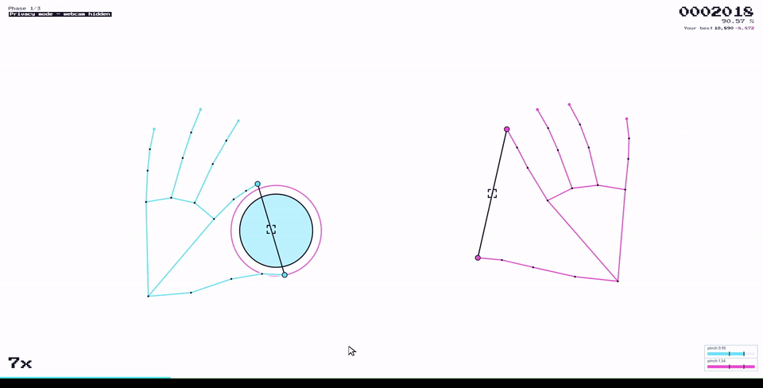

<p align="center">
  
</p>

<h1 align="center">Fingertune</h1>

<p align="center">
  <a href="https://qthullie.github.io/fingertune/"></a>
</p>

<p align="center">
  <b><a href="https://qthullie.github.io/fingertune/">qthullie.github.io/fingertune</a></b><br/>
  <sub>Nothing to install. Allow the webcam and pinch.</sub>
</p>

<p align="center">
  
</p>

<p align="center">
  <sub>Recorded in <b>privacy mode</b> (<kbd>V</kbd>): the webcam image is never drawn, only the tracked skeleton.</sub>
</p>

<p align="center">
  <a href="https://github.com/qthullie/fingertune/actions/workflows/ci.yml"></a>
  <a href="LICENSE"></a>
  
  
  
</p>

> Recognising a hand is easy now. Recognising *when* a gesture happened, to
> within 60 milliseconds, on a consumer webcam, is not. That is the whole
> problem this repository is about — the rhythm game is just the harness that
> makes every error audible.

**Real-time hand-gesture recognition in the browser**, turned into a playable
instrument. A webcam feeds **MediaPipe Hand Landmarker**; the pipeline smooths
the landmarks, decides when thumb and index are *pinched*, and timestamps that
event precisely enough to judge it against a musical beat. One hand, one gesture,
judged in tens of milliseconds.

Everything runs **on-device**: inference is WebAssembly + GPU delegate inside the
tab. No frame, no landmark, no score ever leaves the machine.

> ### This pipeline is not a demo. It ships.
>
> The hand tracking that navigates my portfolio —
> **[qthullie.github.io](https://qthullie.github.io/)** — is this project's code.
> Same MediaPipe Hand Landmarker, same One-Euro filter, same hysteresis pinch
> state machine. Point at the page, pinch to click. **The technology that drives
> the navigation of that portfolio is the technology of this repository.**
>
> A rhythm game is the hardest possible test bench for a gesture recogniser: a
> UI forgives 200 ms of latency, a beat does not. Tune it until it is playable
> and you get an input method that feels instant everywhere else.

## Table of contents

- [The recognition pipeline](#the-recognition-pipeline)
  - [1. Landmarks](#1-landmarks)
  - [2. Smoothing: One-Euro filter](#2-smoothing-one-euro-filter)
  - [3. Pinch detection](#3-pinch-detection)
  - [4. Coordinate spaces](#4-coordinate-spaces)
  - [5. Timing and latency](#5-timing-and-latency)
  - [Tuning and diagnosis](#tuning-and-diagnosis)
- [Beyond the game: pinch as a pointing device](#beyond-the-game-pinch-as-a-pointing-device)
- [The game around it](#the-game-around-it)
- [Bring your own charts](#bring-your-own-charts)
- [Online board](#online-board)
- [Quick start](#quick-start)
- [Project layout](#project-layout)
- [Running fully offline](#running-fully-offline)
- [License](#license)

---

## The recognition pipeline

```
webcam frame (1280×720, VIDEO mode)
      │
      ▼
MediaPipe Hand Landmarker — hand_landmarker.task, float16, GPU delegate
      │  21 landmarks per hand, normalised to the frame
      ▼
mirror x ↦ 1 − x                          (display is mirrored, or it is unplayable)
      │
      ▼
One-Euro filter, one per landmark          lib/oneEuro.ts
      │  21 × 2 adaptive low-passes: still hand ⇒ no jitter, fast hand ⇒ no lag
      ▼
pinch ratio  =  ‖thumb₄ − index₈‖ / ‖wrist₀ − middleMCP₉‖
      │  scale-invariant: same threshold near or far from the camera
      ▼
hysteresis state machine + cooldown         lib/handTracking.ts
      │  ratio < 0.42 ⇒ PINCHED, ratio > 0.62 ⇒ RELEASED, ≥140 ms between triggers
      ▼
rising edge "justPinched" + cursor (thumb–index midpoint)
      │
      ▼
judged against the audio clock: |now − t| ⇒ PERFECT / GOOD / MISS
```

### 1. Landmarks

MediaPipe Hand Landmarker in `VIDEO` running mode, `float16` model, GPU
delegate, `numHands: 1`. Detection is driven from the render loop but skipped
whenever `video.currentTime` has not advanced — the webcam produces ~30 fps while
the loop runs at 60, and inferring twice on the same frame is pure waste.

Only four of the 21 landmarks drive the *decision* — thumb tip (4), index tip
(8), wrist (0), middle-finger MCP (9) — but all 21 are smoothed and drawn, so you
can see exactly what the model sees while you play.

### 2. Smoothing: One-Euro filter

Raw landmarks jitter by a few pixels even on a perfectly still hand. A fixed
low-pass would fix that and add lag precisely when you move fast — fatal for a
game judged in tens of milliseconds.

The [One-Euro filter](https://gery.casiez.net/1euro/) (Casiez, Roussel & Vogel,
CHI 2012) adapts its cutoff frequency to the observed speed:

```
α(cutoff, dt) = 1 / (1 + τ/dt),        τ = 1/(2π·cutoff)
cutoff        = MIN_CUTOFF + BETA · |x̂˙|
```

Slow movement collapses to `MIN_CUTOFF` (heavy smoothing, no jitter); fast
movement raises the cutoff (light smoothing, little lag). Two knobs:
`OEF_MIN_CUTOFF = 1.7` and `OEF_BETA = 0.02`, per axis, per landmark
([`src/lib/oneEuro.ts`](src/lib/oneEuro.ts)).

### 3. Pinch detection

A raw thumb–index distance is useless as a threshold: it shrinks as you move away
from the camera. So the distance is **normalised by the hand's own scale**:

```ts
ratio = ‖thumb₄ − index₈‖ / ‖wrist₀ − middleMCP₉‖
```

The denominator is a rigid segment of the palm — it changes with distance and
hand size exactly like the numerator, so their quotient does not.

That ratio drives a two-threshold state machine. A single threshold at the
boundary would flicker between states on noise alone, firing phantom hits:

| Current state | Condition | Result |
| --- | --- | --- |
| released | `ratio < PINCH_ON_RATIO` (0.45) | → **pinched**, emit `justPinched` |
| pinched | `ratio > PINCH_OFF_RATIO` (0.65) | → released |
| pinched | `0.45 ≤ ratio ≤ 0.65` | stay pinched (dead band) |

A hit is only ever triggered by the **rising edge**, never by the steady state,
and a `PINCH_COOLDOWN_MS = 140` guard rejects a second trigger inside one
gesture. The cursor is the thumb–index midpoint, which stays stable through the
closing motion.

Sliders use the other half of that state machine: the **held** state. Grabbing a
slider head is an edge; keeping it is a per-frame test of `pinching` plus
proximity to the moving ball. That asks something harder of the tracking than a
tap does — the pinch has to survive translation and rotation of the hand for
seconds at a time, which is exactly where a fixed low-pass filter would either
lag behind the drag or let go on jitter.

The edge is also cleared at the start of every detection pass: the webcam runs at
~30 fps while the render loop runs at 60, so a flag left standing would be read
twice and one pinch would consume two targets.

An always-on meter (bottom right, <kbd>P</kbd> to hide) shows the live ratio
against both thresholds — the fastest way to tell "the gesture was not
recognised" apart from "recognised, but off-target or off-beat". A pinch that
hits nothing draws a small white ring at the cursor, so a recognised-but-missed
gesture is still visible.

The pipeline loops over N hands and assigns each detection to a fixed slot from
its **handedness** label rather than its position in the result array — MediaPipe
can swap that order between frames, which would hand one hand's filter state to
the other. `MAX_HANDS` is 1 by default; raising it to 2 works, but the demo chart
is written for one hand.

### 4. Coordinate spaces

The video is mirrored (a non-mirrored feed is unplayable — your hand goes the
wrong way), so landmark `x` becomes `1 − x` at the source and everything
downstream lives in that mirrored space.

There are then **two** spaces, and conflating them is a real bug:

- the **view**, the webcam rectangle drawn in CSS-`cover` fit. Landmarks live
  here, because that is what MediaPipe reports against. In `cover` this rectangle
  is usually *larger* than the window, so part of it is off-screen.
- the **playfield**, the visible intersection of that rectangle and the canvas,
  minus a small margin. Targets live here.

A target placed at `x = 0.2` in *view* space lands outside the window whenever
the window's aspect ratio differs from the webcam's — visible nowhere,
unreachable. Both spaces are converted to pixels
([`src/render/view.ts`](src/render/view.ts)) and hit tests happen there, so the
hit area also stays circular. Press <kbd>F</kbd> to outline the playfield.

### 5. Timing and latency

The judgement clock is the **audio context** (`Tone.now()`), not
`requestAnimationFrame`: a dropped frame then costs pixels, never milliseconds,
and hit windows stay aligned with the music.

What that clock cannot recover is the delay already baked into the input:
webcam exposure and USB transfer, then inference, then the browser's audio output
buffer. The pipeline measures the pinch when it *sees* it, which is inevitably
after it happened — 40 to 80 ms on a laptop. Two things attack that, and they
attack different halves of it.

**Inference runs in a Web Worker.** `detectForVideo` is synchronous and costs
8-20 ms. Called from the render loop, that came straight out of a 16.6 ms frame
budget, so the game was smooth right up until a hand appeared — the only moment
that matters. The model now lives in
[`src/lib/handWorker.ts`](src/lib/handWorker.ts); the main thread hands over an
`ImageBitmap` and takes back 21 points.

Flow control is a single boolean: while a frame is with the worker, no other is
sent. A queue here would mean the model grinding through images the player has
already moved past, so tracking would fall *further* behind the harder the
machine struggled — the opposite of what a struggling machine needs. And the
worker is never required: a COEP header, an extension, or a browser without
module workers all end in inline inference and a console warning, because a game
that runs badly beats a game that refuses. Press <kbd>D</kbd> to see which path
is live.

**The cursor is projected forward.** Threading removes the stutter but adds a
hop, so the remaining latency is met with dead reckoning: the cursor is moved
along its own velocity by `PREDICT_AHEAD` seconds, 45 ms by default. That
velocity is not a new computation — the One-Euro filter already keeps a smoothed
derivative to choose its cutoff, and a second, differently-smoothed estimate
would disagree with the filter it sits on top of.

Prediction has exactly one failure mode and it is sharp: the instant a hand
reverses, the velocity still points the old way and the cursor is flung further
in the wrong direction than the lag it was correcting. `PREDICT_MAX_STEP` caps a
single frame's extrapolation below the width of a target, so the worst case is a
near miss rather than a lurch across the playfield.

Tune it against your own machine rather than against a number: press <kbd>D</kbd>
and watch the reported offset on your hits. Consistently late, raise
`PREDICT_AHEAD`; consistently early, lower it. At `0` this is the behaviour from
before any of it.

### Tuning and diagnosis

Press <kbd>D</kbd> in game for a live overlay: FPS, per-hand tracking state,
handedness, the current pinch ratio and the active thresholds. Watching the ratio
while you pinch is the fastest way to pick your own numbers.

| Setting | Default | Effect |
| --- | --- | --- |
| `PINCH_ON_RATIO` | `0.45` | activation threshold — lower it if hits fire before you close |
| `PINCH_OFF_RATIO` | `0.65` | release threshold — widen the gap if the state flickers |
| `PINCH_COOLDOWN_MS` | `140` | minimum delay between two triggers |
| `OEF_MIN_CUTOFF` | `1.7` | lower = smoother cursor, more lag |
| `OEF_BETA` | `0.02` | higher = snappier on fast moves, more jitter |
| `MAX_HANDS` | `2` | tracked hands (Duet needs both; every other chart is one-handed) |
| `MIN_DETECTION_CONF` / `MIN_TRACKING_CONF` | `0.5` | MediaPipe confidence gates |
| `HAND_LOST_TIMEOUT` | `0.5 s` | grace period before a hand is forgotten |
| `THREADED_INFERENCE` | `true` | run MediaPipe in a Web Worker (falls back inline on its own) |
| `PREDICT_AHEAD` | `0.045 s` | how far ahead the cursor is projected — raise it if hits read late |
| `PREDICT_MAX_STEP` | `0.06` | ceiling on one frame's extrapolation, so a reversal cannot lurch |
| `SHOW_SKELETON` | `true` | draw all 21 landmarks and bones (<kbd>S</kbd>) |
| `SHOW_VIDEO` | `true` | draw the webcam image at all — off is privacy mode (<kbd>V</kbd>) |
| `PIXEL_SCALE` | `1` | screen pixels per rendered pixel; above 1 the playfield goes blocky |
| `SHOW_PINCH_METER` | `true` | live ratio gauge with both thresholds |
| `SHOW_PLAYFIELD` | `false` | outline the area targets can occupy |
| `SLIDER_FOLLOW_SCALE` | `2.2` | follow-circle radius: how much slack while dragging |
| `SLIDER_TICK_INTERVAL` | `0.22 s` | spacing of the tick feedback while following |

Everything is in [`src/config/settings.ts`](src/config/settings.ts) and mutable
live, without a reload:

```js
fingertune.settings.PINCH_ON_RATIO = 0.35;
fingertune.settings.DEBUG = true;
```

---

## Beyond the game: pinch as a pointing device

Strip the beatmap away and what is left is a **pointing device**: a cursor with
sub-pixel stability and a click event with a rising edge, a dead band and a
cooldown. That is exactly the contract a mouse offers — and it is what powers the
navigation of **[qthullie.github.io](https://qthullie.github.io/)**.

The port needed no rewrite of the recognition itself, only a different consumer
of the same three signals:

| Signal from `lib/handTracking.ts` | In Fingertune | On the portfolio |
| --- | --- | --- |
| `cursor` (smoothed thumb–index midpoint) | aim at the target | move the pointer |
| `justPinched` (rising edge) | hit a circle, grab a slider head | click a link |
| `pinching` (held state) | follow a slider ball | drag, scroll, hold |

Two pieces do the heavy lifting, and both are here for the reading:

- **[`lib/oneEuro.ts`](src/lib/oneEuro.ts)** — the reason the cursor does not
  shiver while you read, and does not lag while you reach across the page. A
  fixed low-pass forces you to choose one or the other; the One-Euro filter's
  speed-adaptive cutoff refuses the choice.
- **the hysteresis + cooldown state machine** in
  [`lib/handTracking.ts`](src/lib/handTracking.ts) — the reason a click is one
  click. A single threshold flickers on noise and fires phantom clicks; that is
  merely annoying in a game and unusable in a navigation.

The scale-invariant pinch ratio matters just as much outside the game: a visitor
sits wherever they sit, and the threshold has to hold at 40 cm and at 1.5 m
without a calibration step. Dividing by the wrist–MCP palm segment gives that for
free.

So the honest summary is the inverse of how it looks. The rhythm game is not the
product with a side effect; it is the **test harness**, deliberately the most
demanding consumer of the pipeline, because a note judged to ±60 ms exposes every
millisecond of latency and every false trigger that a web page would quietly
absorb. Pass here and the browser UI is easy.

---

## The game around it

Short version, because the pipeline above is the point.

It is an Osu!-style rhythm game with two note types:

- **circles** — pinch once, as the approach ring closes on the target;
- **sliders** — pinch the head, then *keep pinching* and drag along the track,
  following the ball in the direction of the arrows. Ticks sound while you
  follow. Letting go mid-way is a slider break: it costs the combo, and you can
  grab it again, but the body is graded on the fraction you actually followed
  (`SLIDER_PERFECT_RATIO` 0.85, `SLIDER_GOOD_RATIO` 0.5). One slider therefore
  produces two judgements, head and body, like Osu!.

Hits are graded **Perfect**, **Good** or **Miss**, with a combo and weighted
accuracy. The demo chart runs in three difficulty phases, and each one scales the
ring speed, the timing windows *and* the target size:

| Phase | Approach ring | Timing windows | Targets | Pace |
| --- | --- | --- | --- | --- |
| Easy | 2.6 s | ×3 (Perfect 180 ms) | ×1.4 | one note every 3 s |
| Medium | 1.6 s | ×1.8 | ×1.15 | one note every 1.25 s |
| Hard | 1.0 s | ×1 (Perfect 60 ms) | ×1 | one note every 0.75 s |

The soundtrack is synthesised by Tone.js on the same transport and grows with
each phase; misses are audible; the best score per beatmap is kept in
`localStorage`.

**Three beatmaps**, each built around removing something. *Demo* teaches both
note kinds at a pace that forgives everything. *Pulse* (140 BPM) has no sliders
at all, so nothing asks you to hold a pinch and the notes sit far closer
together — a map about timing and nothing else. *Drift* (100 BPM) is almost all
sliders, which is a test of holding a pinch steady while the whole hand travels,
and that is where the One-Euro filter is least certain. Neither is harder than
the other; they fail for different reasons.

**A run can start at any phase.** Everything before it is dropped and the rest
slides back to zero, so starting at the last phase is a real run at that
difficulty rather than a fast-forward.

**Losing your hand pauses the run** instead of judging notes nobody could see,
and it resumes on its own when the hand comes back — a beat earlier than it
stopped, because being dropped back onto a note already under its ring reads as
the game cheating. <kbd>Space</kbd> pauses deliberately.

**The pinch thresholds are measured, not assumed.** Normalising by hand size
removes the distance to the camera but not the hand: finger length against palm
width varies enough that a threshold comfortable for one player is unreachable
for another. Six seconds of opening and closing sets `PINCH_ON_RATIO` and
`PINCH_OFF_RATIO` from the player's own range, using the 10th and 90th
percentiles so one bad frame cannot set the scale — and refusing outright, with
the defaults left in place, when the sweep is too narrow to mean anything.

**Scores are shareable without a server.** The end screen copies the run plus a
link of the form `#c=<map>.<score>`, which opens the game on that map with that
score to beat and shows it in the HUD with a live signed delta. A fragment, so
it never reaches a server; not tamper-proof, and not meant to be — anyone who
edits it has beaten themselves at a game nobody was refereeing.

**You can play over your own track.** A local file, through
`URL.createObjectURL`, so the audio never leaves the machine, with tap tempo to
match the BPM. The beatmap keeps its own grid and nothing detects the first
downbeat, so a track that does not start on one will sit at a constant offset —
this is a tool for getting close, not a sync.

**Privacy mode hides the webcam image** (<kbd>V</kbd>), and it is the symmetric
of the skeleton toggle that was already there: `SHOW_SKELETON` draws the hand on
top of the video, `SHOW_VIDEO` decides whether the video is drawn at all. With it
off, the frame is never painted — what is left is the skeleton, the targets and
the pinch gauge on flat white. The tracking is untouched; MediaPipe still gets
every frame, only the `drawImage` is skipped.

It exists because the alternative — blurring the background — solves the wrong
problem twice. It is expensive per frame, it still leaks the shape of whoever
walks behind you, and it looks like a video call. Anyone streaming, recording a
clip in a shared flat, or demoing at a conference needs the image gone, not
softened. It also happens to be the better picture: a two-colour skeleton on
white reads at a glance in a way a blurred living room never does.

**The interface is in English and French**, detected from `navigator.language`
and switchable from the toggle on the start screen. Every string lives in
[`src/lib/i18n.ts`](src/lib/i18n.ts), where the English catalogue is the schema
and the French one is typed as `Record<MessageKey, string>` — a missing
translation is a build error, not an English word in the middle of a French
sentence.

**Phones get a screen, not a broken game.** A webcam rhythm game cannot work on
a handheld device: the camera is in the hand that is supposed to be pinching. A
coarse pointer on a small screen therefore lands on a page that says so, offers
to copy the link for later, and still lets you through if you are on a tablet
propped up on a stand.

Charts are plain data — `{ x, y, t }` notes (plus `kind: 'slider'`, `path` and
`duration` for sliders) and phase definitions — in
[`src/beatmaps/demo.ts`](src/beatmaps/demo.ts), which also has `path()`, `ring()`
and `slider()` helpers. Add yours and register it in
[`src/beatmaps/index.ts`](src/beatmaps/index.ts). To play on your own music, drop
a file in `public/music/` and set `VITE_MUSIC_URL`.

Shortcuts: <kbd>Space</kbd> pause · <kbd>R</kbd> replay · <kbd>V</kbd> privacy
mode · <kbd>S</kbd> skeleton · <kbd>M</kbd> metronome · <kbd>P</kbd> pinch gauge ·
<kbd>F</kbd> playfield · <kbd>D</kbd> debug.

## Bring your own charts

Authoring a beatmap costs an evening per minute of music, so a game that ships
four of them has four forever. osu! and StepMania between them have a public
library of hundreds of thousands, in plain-text formats that have barely moved
in a decade and that ask for close enough to the same thing: hit this, on this
beat, then drag along that.

Drop an **`.osz`**, **`.osu`**, **`.sm`** or **`.zip`** on the start screen. An
archive is read in the tab — chart *and* audio — which is what makes it one drag
instead of three: the chart names its track, and nothing else can find that file.
Nothing is uploaded, same as the rest of the game.

It is a conversion, not an emulation, and the parsers are explicit wherever they
make a decision the mapper did not:

| | osu! ([`osu.ts`](src/lib/osu.ts)) | StepMania ([`stepmania.ts`](src/lib/stepmania.ts)) |
| --- | --- | --- |
| Notes | circles map exactly | taps map exactly |
| Paths | sliders walked as polylines through their control points: straight ones exact, curves cut the corner | holds become short downward drags |
| Difficulty | AR, OD and CS through osu!'s own published formulas | fixed, since a stepchart has no equivalent |
| Dropped | spinners | mines, rolls, lifts |
| Invented | nothing | the vertical axis: lanes become columns, height is a slow wave |

Two caveats worth knowing before blaming the importer. osu! is played with a
tablet and this is played with a hand in the air, so a chart that is comfortable
there is usually a tier harder here. And a `.osz` holds every difficulty at once:
the import takes the first by name and tells you which, so unzip and pick another
if it took the wrong one.

The zip reader ([`zip.ts`](src/lib/zip.ts)) is ~150 lines rather than a
dependency — the browser already ships the inflater, and what was left was a
directory walk. Zip64, encryption and unknown compression methods each throw a
named error instead of returning half a chart.

## Online board

Optional, and absent unless configured. Local bests are invisible to everyone but
the person who set them, so the end screen can also post a run to a shared board
per chart.

```bash
# 1. create the table, in the Supabase SQL editor
supabase/migrations/0001_scores.sql

# 2. .env.local
VITE_SUPABASE_URL=https://yourproject.supabase.co
VITE_SUPABASE_ANON_KEY=eyJhbGciOi...
```

**The security boundary is the SQL, not the key.** The anon key ships inside the
JavaScript bundle — that is what "anon" means — so the migration is written
assuming an attacker already has it, because everyone does. Reads are public.
Inserts are allowed and constrained by table checks that refuse impossible rows.
There is deliberately no `update` and no `delete` policy: with row-level security
on, an operation without a policy is denied, and that omission is what stops
anyone rewriting or erasing somebody else's run.

**Scores are not verified and cannot be.** The game runs entirely in your
browser, so any number it sends is a number somebody could have typed instead.
Verifying would mean running the whole judging pipeline a second time, on a
server this project does not have. Rather than imply a rigour that is not there,
the board says so on screen: it is a wall to sign, not a ranking.

With no URL configured the component renders nothing at all. A missing backend is
a working configuration here, not a degraded one.

## Quick start

The game is already live at
**[qthullie.github.io/fingertune](https://qthullie.github.io/fingertune/)** —
nothing to install. To run or modify it locally:

```bash
git clone https://github.com/qthullie/fingertune.git
cd fingertune
npm install
npm run dev
```

Open the printed URL and click **Allow webcam / Play** (**Autoriser la webcam /
Jouer** if your browser asks for French — the interface follows
`navigator.language` and can be switched from the toggle at the top of the start
screen). The model (~7 MB) downloads on first launch, then stays cached.

> The webcam needs a secure context: `localhost` or `https://`. A file opened
> over `file://` is blocked by most browsers.

```bash
npm run build             # typecheck + static build into dist/
npm run build:standalone  # one self-contained HTML into standalone/fingertune.html
```

`dist/` uses a relative base, so it works as-is on GitHub Pages (see
[`.github/workflows/deploy.yml`](.github/workflows/deploy.yml)), Netlify, Vercel
or any static host — over https.

## Project layout

```
src/
  lib/
    handTracking.ts   MediaPipe, landmark smoothing, pinch state machine, hand slots
    oneEuro.ts        One-Euro filter
    audio.ts          Tone.js: reference clock, generated soundtrack, hit/miss sounds
    highscores.ts     localStorage best scores
    errors.ts         technical errors → message keys
    handWorker.ts     MediaPipe in a Web Worker, off the render thread
    osu.ts            .osu charts -> beatmaps
    stepmania.ts      .sm charts -> beatmaps
    chartImport.ts    sniffing, unzipping and audio hookup for a dropped file
    zip.ts            just enough ZIP to open an .osz, no dependency
    leaderboard.ts    the optional online board (Supabase over plain fetch)
    i18n.ts           the English and French catalogues, and the language store
    device.ts         is this a device the game can be played on at all
    preferences.ts    the settings a player chooses, kept across visits
  config/settings.ts  every knob, mutable at runtime
  game/               engine (timing windows, score, phases), slider geometry,
                      effects, types
  render/             view + playfield transforms, renderer (video, targets, skeleton)
  components/         GameCanvas (loop), Hud, Start/Error/End/Mobile screens
  fonts/              Press Start 2P, self-hosted (OFL, see fonts/OFL.txt)
  styles.css          the pixel-art design system
  beatmaps/           charts and phase definitions
supabase/
  migrations/         the board's table, its constraints and its RLS policies
scripts/
  make-og.mjs         draws public/og-card.png, the link-preview card
  fonts/              Inter, for the card only (OFL, see scripts/fonts)
```

## Running fully offline

The wasm binaries are already served from your own origin (copied out of
`node_modules` by [`scripts/copy-assets.mjs`](scripts/copy-assets.mjs)); only the
model comes from Google's CDN. To host that too:

```bash
npm run fetch:model
echo "VITE_HAND_MODEL_URL=./models/hand_landmarker.task" > .env.local
```

## License

[MIT](LICENSE). The `hand_landmarker.task` model is provided by Google under
Apache 2.0. The pixel-art logo is original artwork, MIT licensed with the
project.
